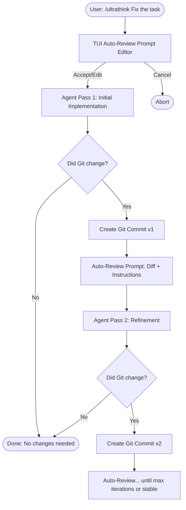

<div align="center">
  <h1>🧠 pi-ultrathink</h1>
  <p><b>An autonomous, multi-pass reasoning loop for Pi</b></p>
</div>

`pi-ultrathink` is a [Pi](https://github.com/mariozechner/pi-coding-agent) extension that gives your agent the ability to reflect, verify, and iteratively improve its work before handing it back to you.

By adding a simple `/ultrathink` command, it transforms single-shot generations into a structured, multi-pass reasoning loop driven by real Git changes.

## 🚀 Why use Ultrathink?

Standard LLM interactions are one-and-done. But complex software engineering tasks—like heavy refactors, tricky bug fixes, or architecture shifts—often require multiple passes:

Think of `pi-ultrathink` as manually dialing up the `thinking_budget` or `reasoning_effort` of a model—but specifically focused on double-checking and self-correction. Just like humans produce better code when they review their own work or take a second look, models significantly improve when forced into an explicit verification pass. 

But it doesn't stop at just "check your work." Because you can edit the **review prompt** before the loop starts, you can use `ultrathink` to encourage the model to keep trying until it makes progress on a specific metric—like getting a test suite to pass or satisfying a particular evaluation script.

1. Draft the initial implementation
2. Review the changes against the original goal
3. Fix edge cases or missed requirements
4. Verify the final state

`pi-ultrathink` automates this entire process.

## 🔄 How the Loop Works



## 🛠️ Usage

Inside Pi, simply prefix your task with `/ultrathink`:

```text
/ultrathink Migrate the database schema to v4 and update all queries
```

### The Interactive Review Prompt

Before the agent starts, a TUI overlay appears. This lets you inspect and modify the **Review Instructions** that will be fed to the agent on subsequent passes.

The prompt is pre-filled with instructions telling the agent to look at the `git diff` of its previous pass and continue *only* if substantial improvements are needed.

- Press **Enter** to accept and start the loop.
- **Edit** the text to add specific review criteria (e.g., "Make sure to check for memory leaks").
- Press **Esc** to cancel.

### The Conversation Flow

The loop unfolds transparently in your chat history. Every pass is visible, and you can see exactly how the agent evaluated its own work:

```text
user: /ultrathink Migrate the database schema...
assistant: [v1] <initial implementation>
user: [Auto] Original task: Migrate...
      Review the current repository changes with: git diff <startSha> HEAD
      Continue working only if...
assistant: [v2] <fixes missed foreign key constraints>
user: [Auto] ...
assistant: [v3] <no changes needed, all good>
```

## 🛑 When does the loop stop?

The loop is completely **Git-driven**. 

1. **Stable State (No Changes):** If a pass results in zero changes to the Git repository, the agent has effectively said "I'm done." The loop stops immediately.
2. **Iteration Cap:** A safety limit (`maxIterations`, default 4) prevents infinite loops.
3. **User Cancellation:** Interrupting the active agent turn (`Escape` by default) or typing a new prompt immediately halts the loop.

## 💾 Git Checkpoints

Every successful pass that alters the codebase automatically generates a Git commit:

`ultrathink(<runId>): v1`

This provides a granular undo history. You can easily roll back to a specific iteration if the agent went down the wrong path in a later pass:

```bash
git log --oneline --graph
```

## 🔮 Roadmap / Future Ideas

- **Context Management Modes:**
  - `clean mode`: Complete context reset between iterations to prevent the model from getting stuck in a rut.
  - `careful mode`: Context reset triggered automatically when the conversation hits a specific token percentage threshold.
- **Improved VS Code Copilot Support:** Run all iterations within a single request by leveraging the `ask_user` tool to integrate the auto-review seamlessly.
- **Oracle Model Support:** Allow a distinct, separate model (e.g., a larger or specialized reasoning model) to conduct the auto-review instead of the model that wrote the code.

## 📦 Installation

**Install from npm:**
```bash
pi install npm:@brain0pia/pi-ultrathink
```

**Quick try (without installation):**
```bash
pi -e npm:@brain0pia/pi-ultrathink
```


## ⚙️ Configuration

You can customize the behavior by creating `.pi/ultrathink.json` in your project root:

```json
{
  "maxIterations": 4,
  "continuationPromptTemplate": "Optional custom review prompt body appended after the fixed task/diff header",
  "commitBodyMaxChars": 4000,
  "git": {
    "mode": "current-branch",
    "allowDirty": false
  }
}
```

### Configuration Options:

- `maxIterations`: Maximum number of refinement passes.
- `continuationPromptTemplate`: Default text for the review TUI.
- `commitBodyMaxChars`: Truncation limit for the agent's summary in the Git commit.
- `git.mode`: 
  - `current-branch` (Default): Commits directly to your active branch.
  - `scratch-branch`: Creates a temporary branch for the loop.
  - `off`: Disables auto-committing entirely.
- `git.allowDirty`: If false, prevents the loop from starting if you have uncommitted changes.

## 💻 Development

Install dependencies and run the checks:

```bash
npm install
npm run check
```

Run the deterministic SDK demo:

```bash
npm run demo
```

The demo uses a fake provider and temporary git repositories, so it does not require real model credentials.
