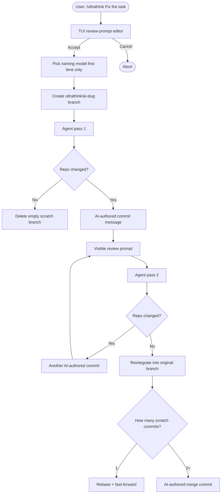

<div align="center">
  <h1>🧠 pi-ultrathink</h1>
  <p><b>A git-driven multi-pass review loop for Pi that works on a temporary branch</b></p>
</div>

`pi-ultrathink` is a [Pi](https://github.com/mariozechner/pi-coding-agent) extension that adds `/ultrathink <prompt>`.

It turns one prompt into a visible review loop that keeps going only while the repository still changes. Every run happens on a dedicated `ultrathink/<slug>` branch, every changed iteration gets its own commit, and the finished work is reintegrated back into the original branch automatically.

## Why use Ultrathink?

Complex coding tasks often need more than one pass. The model writes code, reviews what changed, fixes issues, checks again, and stops only when another pass no longer changes the repo.

Ultrathink makes that process explicit and inspectable:

- the initial task is still a normal visible user message
- follow-up review prompts are also visible user messages
- each changed pass becomes a git commit on a temporary branch
- the final summary prints the branch outcome plus every scratch-branch commit title and description

## How the loop works



## Usage

Inside Pi:

```text
/ultrathink Migrate the database schema to v4 and update all queries
```

### First run: choose a small naming model

The first time you run Ultrathink, it checks `~/.pi/ultrathink.json` for a configured naming model.

If none is set, Ultrathink shows a selector built from Pi’s available models. The selected model is saved to `~/.pi/ultrathink.json` and reused later.

That small model is used only for:

- scratch-branch slug generation
- per-iteration commit title/body generation
- final merge-commit title/body generation when the scratch branch has multiple commits

### Review prompt editor

Before the loop starts, Pi opens the continuation-prompt editor. Ultrathink automatically prepends:

- the original task
- a git diff command based on the run’s baseline commit

You only edit the review instructions that come after that fixed header.

### Conversation flow

The loop stays visible in chat history:

```text
user: /ultrathink Fix the task
assistant: [v1] initial implementation
user: Original task: Fix the task
      Review the current repository changes with:
      git diff <baselineSha> HEAD
assistant: [v2] refinement
user: Original task: Fix the task
      ...
assistant: [v3] no further substantial changes
custom: Ultrathink summary ...
```

## Git behavior

Ultrathink now always uses a temporary branch, but its own config lives globally in `~/.pi/ultrathink.json` instead of inside each repository.

### Scratch branch naming

Each run starts on a branch named:

```text
ultrathink/<ai-generated-slug>
```

There is no run-id suffix in the branch name. If the generated name already exists, Ultrathink asks the naming model for another slug.

### Iteration commits

When an assistant pass changes the repository, Ultrathink creates a commit on the scratch branch.

The title and body are generated by the configured naming model from:

- the original prompt
- the changed files
- a diff summary
- the assistant’s output for that iteration

If an assistant pass leaves the repo unchanged, no commit is created and the loop stops.

### Reintegration into the original branch

When the run ends normally:

- **0 scratch commits** → switch back and delete the scratch branch
- **1 scratch commit** → rebase the scratch branch onto the original branch, then fast-forward the original branch
- **2+ scratch commits** → merge back with one final AI-authored merge commit

On successful reintegration, the `ultrathink/...` branch is deleted.

If the final rebase or merge conflicts, Ultrathink aborts the operation, preserves the scratch branch, and tells you to resolve it manually.

## When does the loop stop?

Ultrathink stops when one of these happens:

1. **No git changes** — the latest pass did not change the repo
2. **Iteration cap** — `maxIterations` was reached
3. **User cancellation** — the user sends another prompt
4. **Interrupt cancellation** — the active assistant turn is aborted
5. **Git or metadata failure** — branch/commit/finalization automation fails

Only normal completions (`no-git-changes`, `max-iterations`) attempt automatic reintegration into the original branch.

## Final summary

At the end of the run, Ultrathink sends a visible summary message that includes:

- original branch
- scratch branch
- naming model
- reintegration result
- whether the scratch branch was deleted
- every scratch-branch commit with SHA, title, and description
- the final merge commit, if one was created

This summary doubles as a work log.

## Configuration

Create `~/.pi/ultrathink.json`: 

```json
{
  "maxIterations": 4,
  "continuationPromptTemplate": "Optional custom review prompt body appended after the fixed task/diff header",
  "commitBodyMaxChars": 4000,
  "naming": {
    "provider": "openai",
    "modelId": "gpt-4.1-mini"
  },
  "git": {
    "allowDirty": false
  }
}
```

### Options

- `maxIterations`: maximum number of assistant iterations
- `continuationPromptTemplate`: default text shown in the review-prompt editor
- `commitBodyMaxChars`: truncation limit for generated commit bodies
- `naming.provider`: provider id for the small naming model
- `naming.modelId`: model id for the small naming model
- `git.allowDirty`: currently kept for backward compatibility, but Ultrathink expects a clean repo before it starts

## Installation

Install from npm:

```bash
pi install @brain0pia/pi-ultrathink
```

Quick try without installation:

```bash
pi -e npm:@brain0pia/pi-ultrathink
```

Local development load:

```bash
pi -e ./src/index.ts
```

## Development

Install dependencies and run checks:

```bash
npm install
npm run check
```

Run the deterministic SDK demo:

```bash
npm run demo
```

The demo uses a scripted provider and does not require real model credentials.
